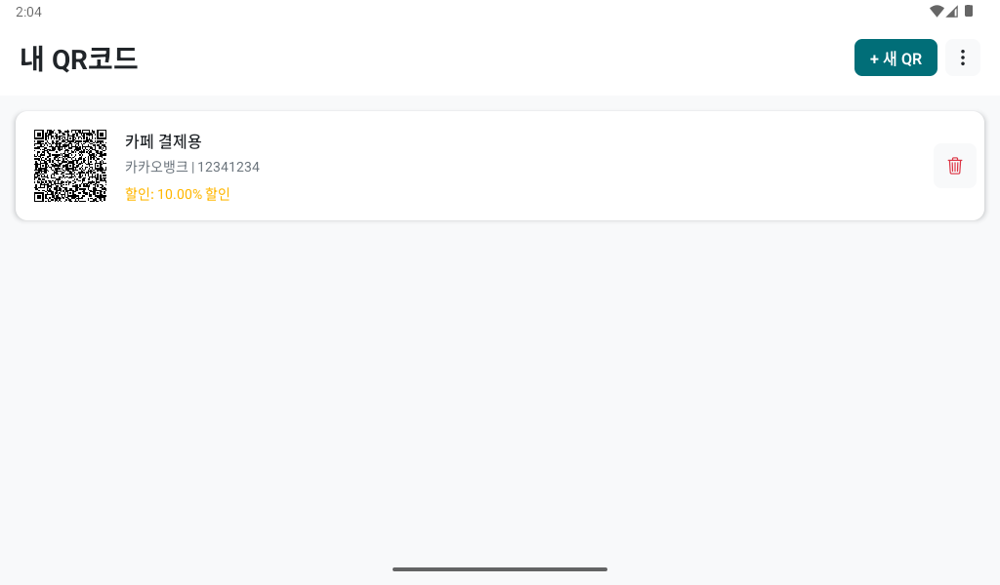
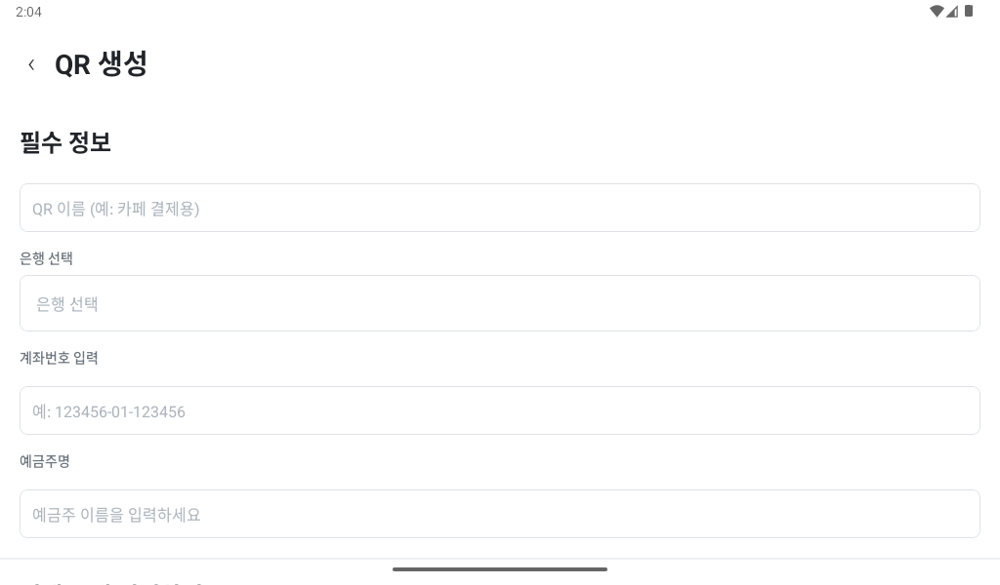
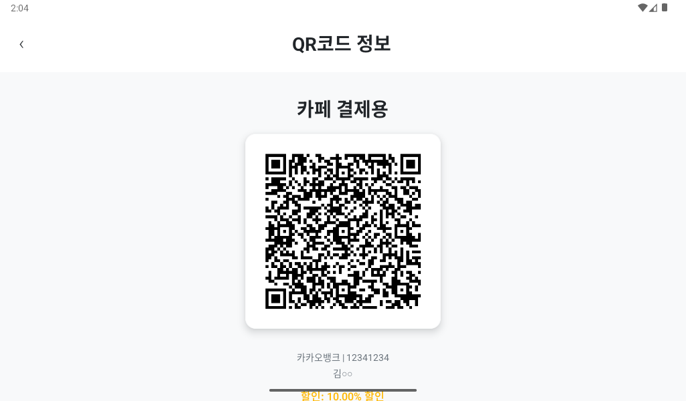
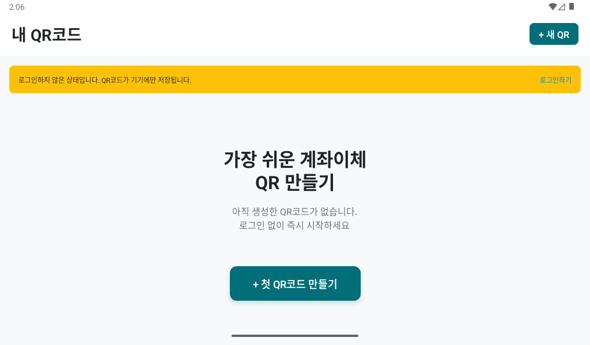

# 착착 (ChackChack) 💳

> 소상공인을 위한 초간단 계좌이체 QR코드 생성 앱

[](https://github.com/Han-ms0331/chackchack)
[](https://play.google.com/store)
[](LICENSE)

## 📱 앱 소개

착착은 IT 기기 사용이 서툰 소상공인(사장님)을 위해 설계된 계좌이체 QR코드 생성 앱입니다.

**핵심 철학: "로그인 없이도 바로 시작할 수 있는 경험"**

### 주요 기능

- 🚀 **로그인 없이 바로 시작** - 게스트로 즉시 사용 가능
- 📱 **간편한 QR 생성** - 계좌 정보 입력만으로 QR코드 생성
- 💰 **금액/할인 설정** - 고정 금액 또는 할인율 적용 가능
- 📸 **갤러리 저장** - QR코드를 이미지로 저장하여 어디서나 사용
- 🔐 **카카오 로그인** - 로그인 시 클라우드 백업 및 동기화
- 📤 **손쉬운 공유** - 카카오톡, 문자 등으로 QR 링크 전송
- 🌐 **웹 송금 페이지** - QR 스캔 시 토스/카카오페이로 바로 송금

## 📸 스크린샷

<div align="center">
  
  
  
  
</div>

## 🏗️ 기술 스택

### Frontend
- **React Native** 0.79.5 - 크로스 플랫폼 모바일 앱
- **Expo** 53.0.20 - 빠른 개발 및 빌드
- **TypeScript** - 타입 안정성
- **Zustand** - 상태 관리
- **React Navigation** - 화면 네비게이션
- **@react-native-seoul/kakao-login** - 카카오 소셜 로그인

### Backend
- **NestJS** 11.0.1 - 확장 가능한 Node.js 프레임워크
- **PostgreSQL** - 관계형 데이터베이스
- **TypeORM** 0.3.25 - ORM
- **JWT** - 인증 토큰
- **Passport** - 인증 미들웨어

### Infrastructure
- **AWS EC2** - 백엔드 서버 호스팅
- **HTTPS** - SSL/TLS 암호화 (api.chackchack.co.kr)
- **EAS Build** - 프로덕션 빌드 및 배포
- **Google Play Store** - 앱 배포

## 📂 프로젝트 구조

```
chackchack/
├── backend/              # NestJS 백엔드
│   ├── src/
│   │   ├── auth/        # 인증 (게스트/소셜 로그인)
│   │   ├── accounts/    # 계좌 관리
│   │   ├── qrcodes/     # QR 코드 CRUD
│   │   ├── notifications/ # 알림 관리
│   │   └── entities/    # TypeORM 엔티티
│   └── public/          # 정적 파일 (손님용 웹)
│
├── frontend/            # React Native 앱
│   ├── src/
│   │   ├── screens/    # 화면 컴포넌트
│   │   ├── api/        # API 클라이언트
│   │   ├── services/   # 카카오 로그인 등
│   │   ├── store/      # Zustand 상태 관리
│   │   └── utils/      # 유틸리티 함수
│   └── android/        # Android 네이티브 설정
│
├── documents/          # 프로젝트 문서
├── assets/             # README용 에셋
└── ui/                 # UI 디자인 참고 자료
```

## 🚀 시작하기

### 사전 요구사항

- Node.js 18+
- PostgreSQL 14+
- Android Studio (Android 개발)
- Expo CLI

### Backend 설정

```bash
cd chackchack/backend
npm install

# .env 파일 생성
cp .env.example .env
# DATABASE_HOST, JWT_SECRET 등 설정

# 개발 서버 실행
npm run start:dev
```

### Frontend 설정

```bash
cd chackchack/frontend
npm install

# Expo 개발 서버 실행
npm start

# Android에서 실행
npm run android
```

### 프로덕션 빌드

```bash
# AAB 빌드 (Google Play Store)
cd chackchack/frontend
eas build -p android --profile production

# APK 빌드 (직접 설치)
eas build -p android --profile preview
```

## 🔐 환경 변수

### Backend (.env)
```env
DATABASE_HOST=localhost
DATABASE_PORT=5432
DATABASE_USER=postgres
DATABASE_PASSWORD=your_password
DATABASE_NAME=chackchack
JWT_SECRET=your_jwt_secret
```

### Frontend
환경 변수는 \`eas.json\`의 \`env\` 필드에서 관리합니다.

## 📝 API 문서

### 주요 엔드포인트

#### 인증
- \`POST /auth/guest\` - 게스트 계정 생성
- \`POST /auth/login\` - 소셜 로그인 (카카오)
- \`DELETE /auth/me\` - 계정 탈퇴

#### QR 코드
- \`POST /qrcodes\` - QR 생성
- \`GET /qrcodes\` - 내 QR 목록
- \`GET /qrcodes/:id\` - QR 상세 (손님용)
- \`PUT /qrcodes/:id\` - QR 수정
- \`DELETE /qrcodes/:id\` - QR 삭제

#### 계좌
- \`POST /accounts\` - 계좌 추가
- \`GET /accounts\` - 계좌 목록

#### 알림
- \`POST /notify/:qrId\` - 입금 알림 전송 (손님용)
- \`GET /notifications\` - 알림 내역

자세한 API 명세는 [API 문서](./documents/api_specification.md)를 참고하세요.

## 🎯 페르소나

1. **박복례 (60대 노점상)**
   - 극도의 단순함 필요
   - 복잡한 기능 회피
   - 로그인 없이 바로 사용

2. **최철민 (40대 대리기사)**
   - 속도와 효율성 중시
   - 여러 QR 코드 관리
   - 빠른 접근성

3. **김아름 (20대 플리마켓 셀러)**
   - 디자인과 브랜드 감성 중요
   - 소셜 공유 기능 활용
   - 클라우드 백업 선호

## 🔑 핵심 기능

### 1. 로그인 없는 첫 경험
게스트 모드로 앱을 설치하자마자 QR 코드를 생성할 수 있습니다. 로그인은 선택사항입니다.

### 2. QR 코드 갤러리 저장
ViewShot + MediaLibrary를 사용하여 QR 코드를 휴대폰 갤러리에 이미지로 저장할 수 있습니다.

### 3. 카카오 소셜 로그인
@react-native-seoul/kakao-login 라이브러리를 사용한 완전한 카카오 로그인 구현:
- 카카오톡 앱 로그인
- 카카오계정 로그인
- 계정 탈퇴 시 카카오 연결 해제

### 4. 손님용 송금 페이지
QR 코드 스캔 시 웹 페이지가 열려 토스 또는 카카오페이로 바로 송금할 수 있습니다.
- 금액/할인 자동 계산
- 딥링크 최적화
- 입금 알림 기능

## 📱 플레이스토어 배포

### 카카오 로그인 이슈 해결
Google Play App Signing을 사용하는 경우, 카카오 개발자 콘솔에 Google Play의 SHA-1 키 해시를 등록해야 합니다.

자세한 내용은 [플레이스토어 카카오 로그인 가이드](./PLAYSTORE_KAKAO_FIX.md)를 참고하세요.

## 🔧 문제 해결

### 카카오 로그인 실패
- 카카오 개발자 콘솔에서 키 해시 확인
- Google Play App Signing 키 해시 등록
- AndroidManifest.xml의 scheme 확인

### 빌드 실패
```bash
# 캐시 정리
cd chackchack/frontend/android
./gradlew clean

# 의존성 재설치
cd ..
rm -rf node_modules
npm install
```

## 📜 라이선스

MIT License

Copyright (c) 2025 Han Myungsoo

## 👨‍💻 개발자

**한명수** (Han Myungsoo)
- GitHub: [@Han-ms0331](https://github.com/Han-ms0331)
- Email: oqwerp@naver.com

## 🙏 감사의 말

이 프로젝트는 소상공인 분들의 편의를 위해 만들어졌습니다.
사용하시면서 불편하신 점이나 개선 아이디어가 있으시면 언제든 이슈를 남겨주세요!

---

**Made with ❤️ for 소상공인**
