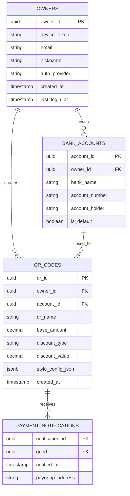

# 착착(ChackChack) ERD (Entity Relationship Diagram)

**Version**: 1.0  
**Date**: 2025-08-13  
**Database**: PostgreSQL with TypeORM

## 개요

착착(ChackChack) 시스템의 데이터베이스 구조를 정의한 ERD입니다. 사용자(소상공인), 계좌, QR코드, 결제 알림 간의 관계를 모델링합니다.

---

## 📊 ERD 다이어그램



---

## 🗂️ 테이블 상세 명세

### 1. OWNERS (사용자)
**목적**: 앱 사용자 정보 저장 (게스트 + 소셜 로그인)

| 컬럼명 | 타입 | 제약조건 | 설명 |
|--------|------|----------|------|
| `owner_id` | UUID | PRIMARY KEY | 사용자 고유 식별자 |
| `device_token` | VARCHAR | NULLABLE | 기기 토큰 (푸시 알림용) |
| `email` | VARCHAR | NULLABLE | 이메일 (소셜 로그인 시) |
| `nickname` | VARCHAR | NULLABLE | 닉네임 (소셜 로그인 시) |
| `auth_provider` | VARCHAR | NULLABLE | 인증 제공자 ('guest', 'kakao', 'naver', 'google') |
| `created_at` | TIMESTAMP | NOT NULL, DEFAULT NOW() | 생성 일시 |
| `last_login_at` | TIMESTAMP | NOT NULL, DEFAULT NOW() | 마지막 로그인 일시 |

#### 인덱스
- `idx_owners_device_token` ON (`device_token`)
- `idx_owners_email` ON (`email`)

#### 제약조건
- 게스트 사용자: `auth_provider = 'guest'`, `email = NULL`, `nickname = NULL`
- 소셜 로그인 사용자: `auth_provider != 'guest'`, `email IS NOT NULL`

---

### 2. BANK_ACCOUNTS (은행 계좌)
**목적**: 사용자의 은행 계좌 정보 저장

| 컬럼명 | 타입 | 제약조건 | 설명 |
|--------|------|----------|------|
| `account_id` | UUID | PRIMARY KEY | 계좌 고유 식별자 |
| `owner_id` | UUID | FOREIGN KEY, NOT NULL | 계좌 소유자 ID |
| `bank_name` | VARCHAR(50) | NOT NULL | 은행명 |
| `account_number` | VARCHAR(50) | NOT NULL | 계좌번호 |
| `account_holder` | VARCHAR(50) | NOT NULL | 예금주명 |
| `is_default` | BOOLEAN | DEFAULT FALSE | 기본 계좌 여부 |

#### 인덱스
- `idx_bank_accounts_owner_id` ON (`owner_id`)
- `idx_bank_accounts_default` ON (`owner_id`, `is_default`)

#### 제약조건
- `fk_bank_accounts_owner` FOREIGN KEY (`owner_id`) REFERENCES `owners`(`owner_id`)
- 같은 사용자가 동일한 계좌번호 중복 등록 불가

#### 지원 은행
- 국민은행, 신한은행, 우리은행, 하나은행, 농협은행
- 카카오뱅크, 토스뱅크, IBK기업은행, SC제일은행, 대구은행

---

### 3. QR_CODES (QR코드)
**목적**: 생성된 QR코드 정보 저장

| 컬럼명 | 타입 | 제약조건 | 설명 |
|--------|------|----------|------|
| `qr_id` | UUID | PRIMARY KEY | QR코드 고유 식별자 |
| `owner_id` | UUID | FOREIGN KEY, NOT NULL | QR 생성자 ID |
| `account_id` | UUID | FOREIGN KEY, NOT NULL | 연결된 계좌 ID |
| `qr_name` | VARCHAR(100) | NOT NULL | QR코드 이름 |
| `base_amount` | DECIMAL(10,2) | NULLABLE | 기본 금액 |
| `discount_type` | VARCHAR(20) | NULLABLE | 할인 타입 ('percentage', 'fixed') |
| `discount_value` | DECIMAL(10,2) | NULLABLE | 할인 값 |
| `style_config_json` | JSONB | NULLABLE | 스타일 설정 (추후 사용) |
| `created_at` | TIMESTAMP | NOT NULL, DEFAULT NOW() | 생성 일시 |

#### 인덱스
- `idx_qr_codes_owner_id` ON (`owner_id`)
- `idx_qr_codes_account_id` ON (`account_id`)
- `idx_qr_codes_created_at` ON (`created_at` DESC)

#### 제약조건
- `fk_qr_codes_owner` FOREIGN KEY (`owner_id`) REFERENCES `owners`(`owner_id`)
- `fk_qr_codes_account` FOREIGN KEY (`account_id`) REFERENCES `bank_accounts`(`account_id`)
- `discount_type` IN ('percentage', 'fixed') OR NULL
- `base_amount >= 0` (음수 금액 불가)
- `discount_value >= 0` (음수 할인 불가)

#### 비즈니스 규칙
- 할인이 있을 경우 `base_amount`는 필수
- `discount_type`이 'percentage'인 경우 `discount_value`는 0~100
- `discount_type`이 'fixed'인 경우 `discount_value <= base_amount`

---

### 4. PAYMENT_NOTIFICATIONS (결제 알림)
**목적**: 손님이 결제 완료 알림을 보낸 기록 저장

| 컬럼명 | 타입 | 제약조건 | 설명 |
|--------|------|----------|------|
| `notification_id` | UUID | PRIMARY KEY | 알림 고유 식별자 |
| `qr_id` | UUID | FOREIGN KEY, NOT NULL | 관련 QR코드 ID |
| `notified_at` | TIMESTAMP | NOT NULL, DEFAULT NOW() | 알림 발송 일시 |
| `payer_ip_address` | VARCHAR(45) | NULLABLE | 결제자 IP 주소 |

#### 인덱스
- `idx_payment_notifications_qr_id` ON (`qr_id`)
- `idx_payment_notifications_notified_at` ON (`notified_at` DESC)

#### 제약조건
- `fk_payment_notifications_qr` FOREIGN KEY (`qr_id`) REFERENCES `qr_codes`(`qr_id`)

---

## 🔗 관계 정의

### 1. OWNERS ↔ BANK_ACCOUNTS (1:N)
- **관계**: 한 사용자는 여러 계좌를 가질 수 있음
- **삭제 정책**: CASCADE (사용자 삭제 시 모든 계좌 삭제)
- **비즈니스 규칙**: 사용자당 기본 계좌는 최대 1개

### 2. OWNERS ↔ QR_CODES (1:N)  
- **관계**: 한 사용자는 여러 QR코드를 생성할 수 있음
- **삭제 정책**: CASCADE (사용자 삭제 시 모든 QR코드 삭제)
- **비즈니스 규칙**: QR코드는 반드시 사용자 소유 계좌와 연결

### 3. BANK_ACCOUNTS ↔ QR_CODES (1:N)
- **관계**: 한 계좌는 여러 QR코드에 사용될 수 있음  
- **삭제 정책**: RESTRICT (QR코드가 있는 계좌는 삭제 불가)
- **비즈니스 규칙**: QR코드와 계좌의 owner_id 일치 필요

### 4. QR_CODES ↔ PAYMENT_NOTIFICATIONS (1:N)
- **관계**: 한 QR코드는 여러 결제 알림을 받을 수 있음
- **삭제 정책**: CASCADE (QR코드 삭제 시 관련 알림 모두 삭제)
- **비즈니스 규칙**: 알림은 실제 존재하는 QR코드에 대해서만 생성

---

## 🏗️ 데이터베이스 설정

### PostgreSQL 버전
- **최소 요구사항**: PostgreSQL 12+
- **추천 버전**: PostgreSQL 14+
- **필수 확장**: `uuid-ossp` (UUID 생성용)

### TypeORM 설정
```typescript
{
  type: 'postgres',
  host: 'localhost', 
  port: 5432,
  username: 'your_user',
  password: 'your_password',
  database: 'chackchack',
  entities: [Owner, BankAccount, QrCode, PaymentNotification],
  synchronize: false, // 프로덕션에서는 false
  logging: true // 개발 시에만 true
}
```

### 초기 데이터
```sql
-- UUID 확장 활성화
CREATE EXTENSION IF NOT EXISTS "uuid-ossp";

-- 테이블 생성은 TypeORM 자동 생성 또는 마이그레이션 사용
```

---

## 📈 성능 최적화

### 쿼리 최적화
- QR코드 목록 조회 시 `JOIN`을 통한 계좌 정보 포함
- 페이지네이션을 통한 대용량 데이터 처리
- 자주 사용되는 쿼리에 대한 복합 인덱스

### 캐싱 전략
- QR코드 이미지는 CDN 캐싱 고려
- 자주 조회되는 사용자 정보는 Redis 캐싱
- 계좌 정보는 변경 빈도가 낮으므로 장기간 캐싱

---

## 🔒 보안 고려사항

### 데이터 암호화
- **계좌번호**: 단방향 해시 또는 양방향 암호화 검토 필요
- **IP 주소**: GDPR 준수를 위한 개인정보 처리 방침 필요

### 접근 제어
- 사용자는 본인의 데이터에만 접근 가능
- QR코드 공개 조회는 `qr_id`로만 가능 (소유자 정보 제외)

### 감사 로그
- 중요한 데이터 변경 시 감사 로그 기록 고려
- 결제 알림은 이미 시간 정보 포함으로 감사 가능

---

## 🚀 확장 계획

### v1.1 예정 변경사항
- `qr_codes` 테이블에 `logo_url` 컬럼 추가 (QR 로고)
- `owners` 테이블에 `push_enabled` 컬럼 추가 (푸시 설정)

### v1.2 예정 변경사항  
- `PAYMENT_STATISTICS` 테이블 추가 (결제 통계)
- `QR_STYLES` 테이블 추가 (QR 스타일 템플릿)

### v1.3 예정 변경사항
- `TRANSACTIONS` 테이블 추가 (실제 거래 기록)
- `SETTLEMENTS` 테이블 추가 (정산 정보)

---

## 📝 마이그레이션 가이드

### 초기 마이그레이션 (v1.0)
```sql
-- 1. 확장 설치
CREATE EXTENSION IF NOT EXISTS "uuid-ossp";

-- 2. 테이블 생성 (TypeORM으로 자동 생성)
-- 3. 초기 인덱스 생성 (TypeORM으로 자동 생성)
-- 4. 제약조건 설정 (TypeORM으로 자동 생성)
```

### 데이터 백업
```sql  
-- 전체 데이터 백업
pg_dump chackchack > backup_v1.0.sql

-- 테이블별 백업
pg_dump -t owners chackchack > owners_backup.sql
pg_dump -t bank_accounts chackchack > accounts_backup.sql
pg_dump -t qr_codes chackchack > qrcodes_backup.sql
pg_dump -t payment_notifications chackchack > notifications_backup.sql
```

---

## 변경 이력

### Version 1.0 (2025-08-13)
- 초기 ERD 작성
- 4개 핵심 테이블 정의 (OWNERS, BANK_ACCOUNTS, QR_CODES, PAYMENT_NOTIFICATIONS)
- 관계 정의 및 제약조건 설정
- 인덱스 및 성능 최적화 방안 포함